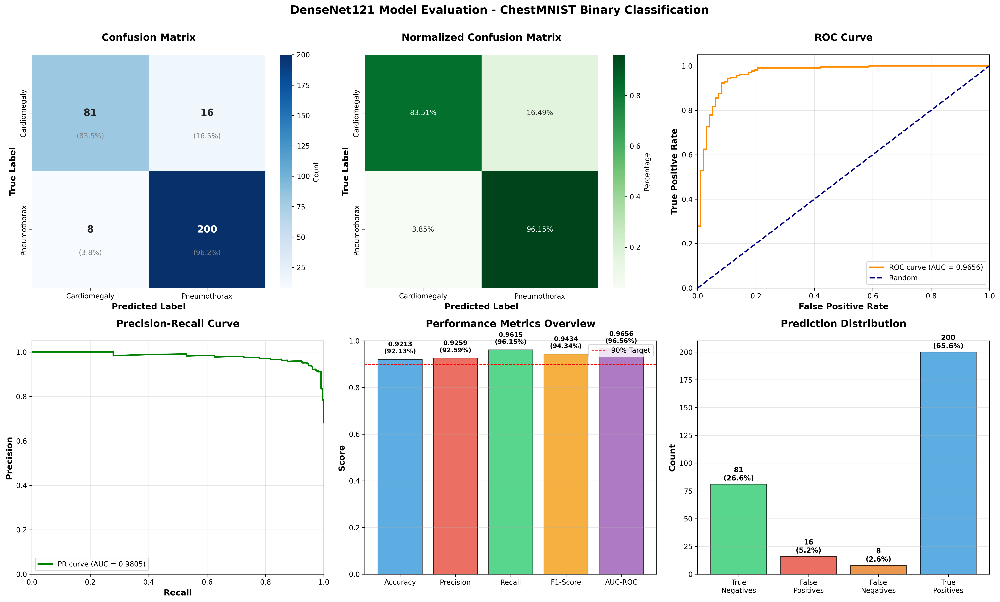

# ChestMNIST Binary Classification - DenseNet121

[](https://www.python.org/)
[](https://pytorch.org/)
[](README.md)

##  Project Overview

Deep learning untuk klasifikasi biner penyakit paru-paru menggunakan ChestMNIST. Model DenseNet121 mencapai **92.13% validation accuracy**.

###  Best Results
- **Validation Accuracy**: 92.13%
- **AUC-ROC**: 96.56%
- **F1-Score**: 94.34%
- **Sensitivity**: 96.15%

##  Project Structure
```
chestmnist-classification/
 models/           # Model architectures
 data/             # Data loaders
 scripts/          # Training & evaluation
 utils/            # Utilities
 results/          # Visualizations
 docs/             # Documentation
 trained_models/   # Saved models (not in git)
```

##  Quick Start
```bash
# Install dependencies
pip install -r requirements.txt

# Verify GPU
python utils/check_gpu.py

# Train DenseNet121
python scripts/train_densenet.py

# Evaluate
python scripts/evaluate_densenet.py
```

##  Model Comparison
| Model | Val Acc | AUC | Parameters |
|-------|---------|-----|------------|
| **DenseNet121**  | **92.13%** | **96.56%** | **7.6M** |
| SimpleCNN_HighRes | 85.25% | 92.54% | 8.9M |
| Ensemble | 83.14% | 89.68% | 11.3M |

##  Results


##  Documentation
- docs/GUIDE_TO_95_PERCENT.md - Roadmap to 95%
- docs/GITHUB_UPLOAD_GUIDE.md - GitHub tutorial

##  Contact
- GitHub: [@burntheboatsz](https://github.com/burntheboatsz)

** 92.13% Accuracy Achieved!**
